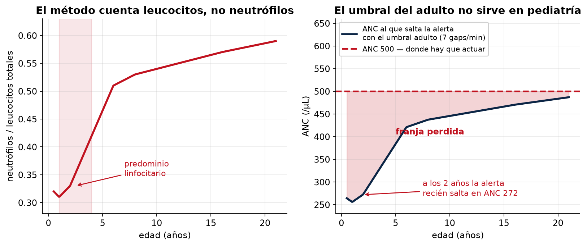
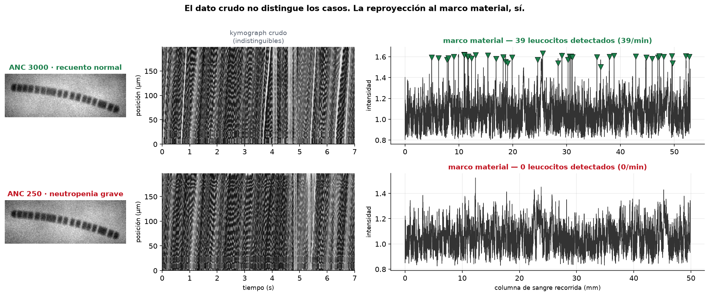
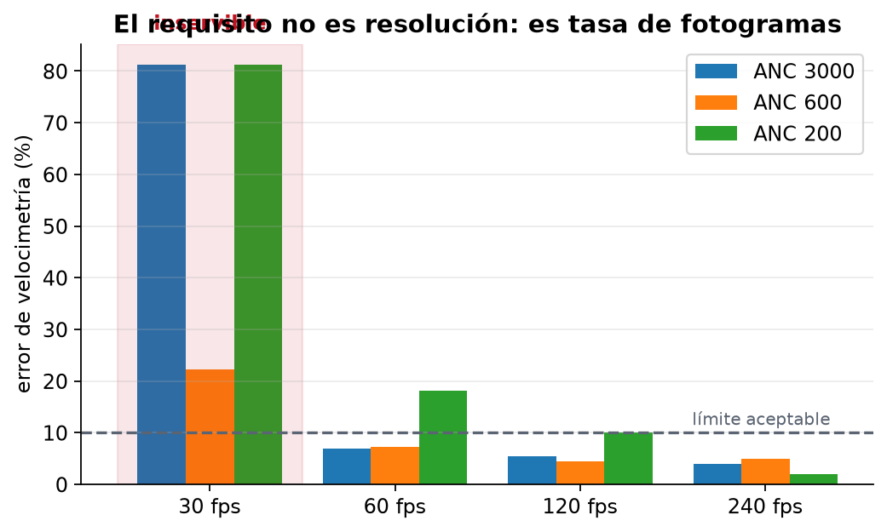
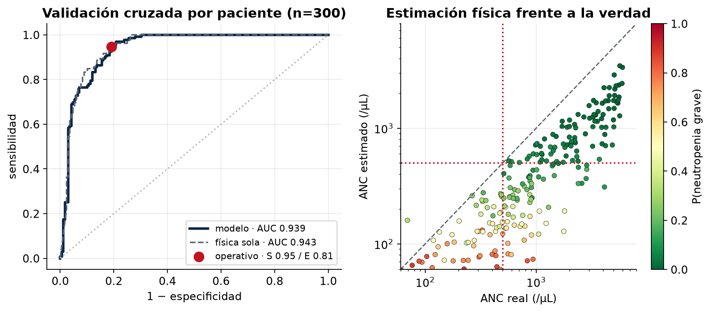
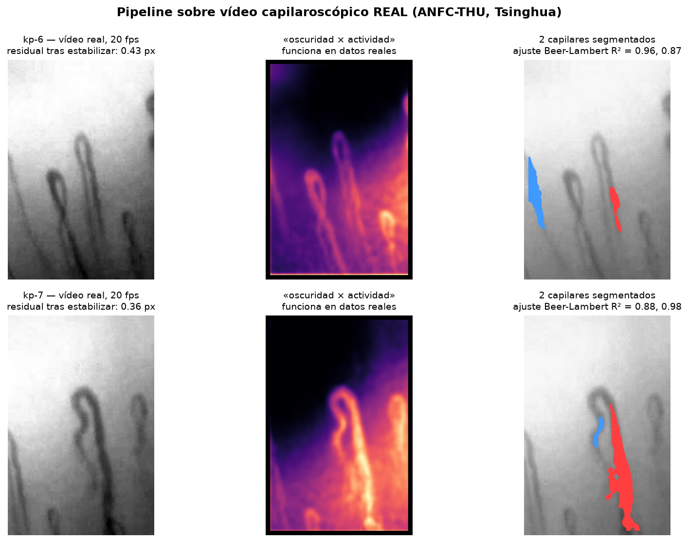

# Yawar Ñan — Ruta hematológica sin agujas

**Hackatón Niño San Borja 2026 · Desafío 3: Ruta Hematológica**

*Yawar Ñan* significa «camino de la sangre» en quechua.

Tamizaje óptico **no invasivo** de neutropenia grave en niños con Leucemia
Linfoblástica Aguda, para sostener la continuidad del tratamiento cuando el
paciente vive lejos de Lima.

---

## El problema, en tres datos del propio INSNSB

| Dato | Fuente |
|---|---|
| Hematología concentra el **47.21%** del cáncer infantil del instituto | Sala Situacional, nov. 2025 |
| La LLA es la **primera causa de muerte** (15.21%), con **73.91%** de riesgo alto | Sala Situacional, nov. 2025 |
| El **56.22%** de los pacientes fallecidos **no venía de Lima ni Callao** | Sala Situacional, nov. 2025 |

Un niño con LLA necesita control hematológico estricto para prevenir la
neutropenia febril, que es una emergencia oncológica. Pero el hemograma exige
laboratorio, y el laboratorio está en Lima. Entre control y control pueden pasar
tres semanas en las que nadie sabe cómo está su recuento.

**No proponemos reemplazar el hemograma. Proponemos llenar los días en que el
niño no tiene ninguno.**

---

## Cómo funciona

Bajo luz de ~420 nm (banda de Soret de la hemoglobina) los eritrocitos absorben
y el capilar del lecho ungueal se ve oscuro. Un leucocito no tiene hemoglobina:
deja pasar la luz y desplaza a los eritrocitos aguas abajo. Aparece un **gap
óptico** brillante que viaja por el capilar.

Contar gaps es contar leucocitos, y el modelo es puramente geométrico:

```
R = C · v · π(d/2)² · 60 · 10⁻⁹
```

`R` = gaps/capilar/min · `C` = células/µL · `v` = velocidad (µm/s) · `d` = diámetro (µm)

El pipeline:

```
vídeo → estabilizar → segmentar lumen → kymograph
      → medir velocidad → reproyectar al marco material → contar gaps
      → corregir por edad → triaje clínico → HL7 / FHIR
```

---

## Qué hicimos distinto

El método óptico existe y hay un dispositivo comercial (PointCheck, de Leuko,
con designación *FDA Breakthrough*) validado en **adultos**. Nuestras cuatro
diferencias son técnicas, no de presentación:

### 1. Corrección pediátrica — el umbral del adulto no sirve en un niño

El método cuenta **leucocitos totales**, no neutrófilos. En pediatría la
fracción de neutrófilos varía enormemente con la edad: ~31% al año de vida
frente a ~59% en el adulto (predominio linfocitario hasta el «cruce» a los 4–6
años).

| | Con el umbral adulto de 7 gaps/min |
|---|---|
| Adulto | se dispara en ANC ≈ **487** ✓ |
| Niño de 2 años | se dispara en ANC ≈ **272** ✗ |

**Se pierde entera la franja ANC 272–500**, que es exactamente donde hay que
actuar. El umbral correcto a esa edad es **12.8 gaps/min**, no 7.



### 2. Auto-calibración — medimos lo que los demás asumen

El trabajo de referencia *asume* v = 800 µm/s y d = 15 µm para todos. Nosotros
los medimos en el propio vídeo. No es un lujo: los capilares pediátricos son más
anchos y menos densos, y el diámetro entra **al cuadrado** en el cálculo.

Umbralizar la máscara subestima el diámetro un ~15% de forma sistemática —por
física, no por bug: cerca del borde la cuerda óptica tiende a cero y no hay
contraste que detectar. Ajustando en cambio el perfil de Beer-Lambert:

| Método | Sesgo en diámetro | Error en recuento |
|---|---|---|
| Umbral | 0.87× | **−25%** |
| Ajuste del perfil | 1.02× | **+3%** |

### 3. Marco material — mirar la sangre desde la sangre

Un gap que se mueve es difícil de detectar. Pero conocida la velocidad, en la
coordenada `ξ = s − D(t)` el gap está quieto: su estría diagonal se vuelve una
línea vertical. La SNR mejora en √n con los fotogramas en que es visible (~3.7×
en condiciones típicas), y **cada gap se cuenta una sola vez por construcción**.

Ese margen es lo que permite bajar de una cámara científica a la cámara de un
celular de posta. Y se ve: en el dato crudo los dos casos son indistinguibles;
tras la reproyección, la diferencia es de 40 leucocitos frente a 1.



### 4. Sabe cuándo no puede medir

El modo de fallo más peligroso de este método no está en el vídeo. La presión
dentro de un capilar ungueal es de 25–35 mmHg; si el niño **aprieta el dedo**, el
capilar se colapsa, no pasa ningún leucocito, y el algoritmo concluye
«neutropenia grave» con toda coherencia interna.

Un error de posicionamiento se disfraza del hallazgo más alarmante posible. Por
eso el módulo ESP32 mide la fuerza de contacto (ventana segura: 0.08–0.50 N) y
bloquea la captura fuera de ella.

---

## Un hallazgo que conviene conocer antes de comprar hardware

La velocimetría sigue estructuras que viajan con la sangre. Los eritrocitos
tienen período espacial ~11 µm y a 800 µm/s la sangre avanza 13.3 µm entre
fotogramas a 60 fps: **más de un período completo**.

Error de velocimetría medido sobre cohorte sintética (v real = 800 µm/s):

| fps | ANC 3000 | ANC 1500 | ANC 600 | ANC 200 |
|---|---|---|---|---|
| **30** | 81% | 81% | 22% | 81% |
| **60** | 6.9% | 7.3% | 7.3% | 18.2% |
| **120** | 5.5% | 4.5% | 4.5% | 10.0% |
| **240** | 3.9% | 5.9% | 5.0% | **1.9%** |

**≥60 fps es requisito; la tasa de fotogramas importa mucho más que la
resolución** — al revés de lo que sugiere la intuición al comprar un teléfono.



Nótese la última columna: el error empeora cuando el ANC baja, o sea justo en el
caso crítico. Por eso el sistema guarda la **velocidad basal de cada paciente**,
medida en un control con hemograma pareado. El equipo se empareja con el niño,
no con la población.

---

## Rendimiento

Validación cruzada **por paciente** sobre cohorte sintética generada con la
configuración real del prototipo (530 nm oblicuo, 1.4 µm/px, fototipos
Fitzpatrick II–VI muestreados según la población peruana). n=300, 44% con
neutropenia grave:

| Métrica | Valor |
|---|---|
| AUC | **0.939** |
| Sensibilidad | **0.947** |
| Especificidad | 0.810 |
| **VPN** | **0.951** ← lo que importa en tamizaje |
| Brier | 0.096 |

### Comprobación de equidad por fototipo

Entrenar con un solo tipo de piel habría hecho invisible el sesgo. Muestreando
fototipos se puede medir:

| Fototipo | n | AUC |
|---|---|---|
| II | 18 | 0.987 |
| III | 87 | 0.923 |
| IV | 109 | 0.959 |
| V | 61 | 0.937 |
| VI | 25 | 0.889 |

Hay un gradiente de ~0.10 de AUC entre la piel más clara y la más oscura. Es
mucho menor del que produciría iluminación azul (§ `docs/hardware.md`), pero
existe. Con n=18 y n=25 en los extremos esas cifras son ruidosas: se reportan
como evidencia de que el sesgo se vigila, no como medida definitiva.



El umbral se fija por **sensibilidad objetivo (95%)**, no maximizando exactitud:
no detectar una neutropenia grave y detectarla de más no son errores comparables.

### Sobre el modelo: elegimos el más simple que funciona

| Modelo | AUC | Brier |
|---|---|---|
| Física sola (sin modelo) | 0.916 | — |
| **Logística compacta (4 variables)** | **0.921** | **0.115** |
| Logística (13 variables) | 0.921 | 0.112 |
| Gradient boosting (13 variables) | 0.892 | 0.125 |

El gradient boosting es **peor que no usar modelo**: con 300 casos y 13 variables
sobreajusta y destruye la calibración. Embarcamos la logística de 4 parámetros
porque su destino es reajustarse con 30–50 casos reales — con esa cantidad de
datos, cuatro parámetros se estiman y trece no.

Además es auditable: sus coeficientes redescubren por su cuenta que
*concentración = eventos / volumen* (−2.41 en eventos, +1.35 en volumen).

## Estructura

```
src/yawar/
  optics.py        modelo físico, priors pediátricos, bandas NCI
  synth.py         simulador de videocapilaroscopía (Beer-Lambert + cámara)
  vision/          estabilizar · segmentar · kymograph · velocidad · gaps
  pipeline.py      orquestación y control de calidad
  model.py         clasificador calibrado
  triage.py        semáforo clínico y neutropenia febril
  interop/         HL7 v2 (ORU^R01) y FHIR R4
services/api/      FastAPI: tamizaje, triaje, cohorte, export HL7/FHIR
apps/web/          PWA offline-first para la posta
firmware/          ESP32: presión de contacto, estrobo, iluminación estable
notebooks/         notebook de Colab, end-to-end
scripts/           generación de cohorte, notebook y figuras
tests/             30 tests, incluida la verificación contra la literatura
docs/
  anexo1_entrega_final.md    formato de entrega de la hackatón
  anexo2_declaracion_ia.md   declaración de uso de IA generativa
  pitch.md                   guion de 5 min, ordenado por la rúbrica
  protocolo_clinico.md       criterios de uso y derivación (a firmar)
  hardware.md                BOM, óptica 530 nm, calibración, riesgos de armado
  interoperabilidad.md       HL7 v2, FHIR PE Core, RENHICE y qué pedirle al INSNSB
```

## Interoperabilidad: alineados con el estándar nacional

El MINSA publica una guía FHIR propia —[`HL7.FHIR.PE.COREPE`](https://dyaku.minsa.gob.pe/guides/)—
que es el estándar al que deben ajustarse los sistemas que interoperen con
**RENHICE** (Ley 30024). Emitimos los dos formatos que el sistema peruano
necesita:

- **HL7 v2 ORU^R01** para el HIS actual del instituto (Galenus)
- **FHIR R4 con perfiles PE Core** (`PacientePe`, `OrganizacionPe`, `BundlePe`,
  identificación por RENIPRESS) hacia RENHICE, vía el SIHCE acreditado

La guía nacional **todavía no define perfiles de `Observation` ni
`DiagnosticReport`** — cubre el conjunto mínimo IPS. Nuestro bundle lo **declara
explícitamente** en vez de fingir conformidad: qué recursos siguen el perfil
peruano y cuáles van en R4 base porque el perfil aún no existe.

Ese hueco es también una oportunidad: un perfil de `Observation` para
resultados de tamizaje es algo que hoy le falta al país.

## Uso rápido

```bash
python -m venv .venv && source .venv/bin/activate
pip install -e ".[api,viz,dev]"

pytest                                            # 30 tests
python scripts/build_dataset.py --n-patients 300  # cohorte sintética (~20 min)
python scripts/make_figures.py                    # figuras del pitch
jupyter notebook notebooks/01_yawar_colab.ipynb
```

**Demo completa** (API + PWA, funciona sin hardware) — un solo comando:

```bash
bash scripts/demo.sh
# → interfaz en http://127.0.0.1:8080 · API en http://127.0.0.1:8000/docs
```

**Validación contra vídeo real** (descarga fuentes de acceso abierto):

```bash
python scripts/validar_datos_reales.py --descargar
```

## Validación contra datos reales

Todo lo demás se valida sobre datos sintéticos. Esta es la única pieza que
enfrenta el pipeline a imágenes que no generamos nosotros, con fuentes
públicas: el material suplementario de **Bourquard et al. 2018** (las
adquisiciones del propio trabajo de referencia) y dos vídeos de muestra del
dataset **ANFC-THU** de Tsinghua.



| | Estado |
|---|---|
| Estabilización (residual < 0.5 px) | ✅ validado en real |
| Criterio «oscuridad × actividad» | ✅ validado en real |
| Segmentación por forma alargada | ✅ validado en real |
| Ajuste Beer-Lambert del diámetro | ⚠️ R² 0.87–0.98 en ANFC, peor en campo amplio |
| Escala espacial (µm/px) | ⚠️ **supuesta**: ninguna fuente pública trae barra de calibración |
| Velocimetría y conteo de gaps | ❌ no validable: los vídeos de ANFC son de 20 fps, por debajo de nuestro propio requisito de ≥55 |
| Cadena completa hasta el ANC | ❌ requiere vídeo con escala conocida y hemograma pareado |

Reescribimos la segmentación **por lo que falló aquí**, no por teoría: la
versión anterior se quedaba con el marco de la imagen o con manchas del 40% del
campo, y devolvía una línea media perfectamente plausible mientras lo hacía.

---

## Sobre los datos

**Ningún dato de este repositorio proviene de pacientes reales.** Las bases de la
hackatón lo prohíben expresamente, y un tamizaje clínico tampoco puede
sustentarse en «confíen en nosotros». La solución es simular el proceso físico
completo, con verdad-terreno conocida por construcción — lo que además permite
someter al pipeline a condiciones que un dataset real difícilmente cubriría.

Las métricas del notebook miden **la coherencia del pipeline, no su exactitud
clínica**. Esa distinción es importante y la sostenemos también en el pitch.

## Qué falta

| | |
|---|---|
| ⚠️ | La amplitud de las ondas de densidad eritrocitaria (25%) es un supuesto a validar contra vídeo real |
| ❌ | Validación con vídeo real del INSNSB contra hemograma como patrón de referencia |
| ❌ | Estudio de concordancia con tamaño muestral suficiente para fijar el umbral definitivo |

El siguiente paso no es más código: son **30–50 vídeos reales con hemograma
pareado**. Con eso la capa de calibración se reajusta y las métricas pasan a
significar algo clínico.

---

## Advertencia de uso

Este es un **prototipo de investigación**. No es un dispositivo médico, no está
registrado ante DIGEMID y no debe usarse para tomar decisiones clínicas. El
tamizaje óptico **no sustituye al hemograma** y **no puede descartar
neutropenia**: sólo puede detectar sospecha y escalar.

## Licencia

Código: **Apache-2.0** · Documentación: **CC BY 4.0**

## Referencias

- Bourquard et al. *Non-invasive detection of severe neutropenia in chemotherapy patients by optical imaging of nailfold microcirculation.* Sci Rep 2018. [PMC5871877](https://pmc.ncbi.nlm.nih.gov/articles/PMC5871877/)
- *Performance Evaluation of a Novel Non-Invasive Monitoring Device for At-Home Neutropenia Detection in a Multicenter Cancer Cohort.* Am J Hematol. [10.1002/ajh.70369](https://onlinelibrary.wiley.com/doi/10.1002/ajh.70369)
- *Usability Evaluation of a Noninvasive Neutropenia Screening Device (PointCheck).* [PMC9621111](https://pmc.ncbi.nlm.nih.gov/articles/PMC9621111/)
- *Visualization of blood cell contrast in nailfold capillaries with high-speed reverse lens mobile phone microscopy.* Biomed Opt Express 2020. [PubMed 32341882](https://pubmed.ncbi.nlm.nih.gov/32341882/)
- Sabith et al. *Smartphone based non-invasive real time white blood cell counter.* Sci Rep 2025. [PMC11724022](https://pmc.ncbi.nlm.nih.gov/articles/PMC11724022/)
- INSN San Borja. *Sala Situacional — Epidemiología, noviembre 2025.*
